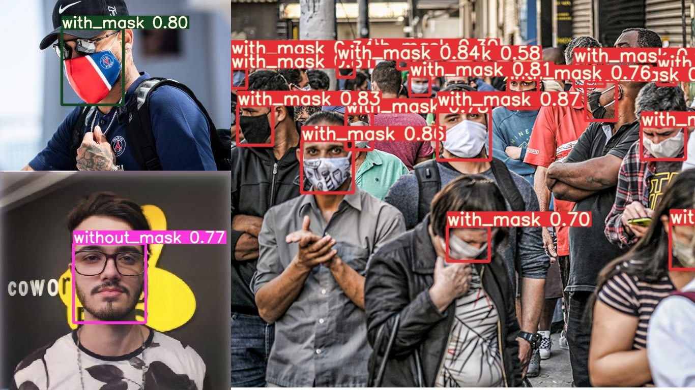

# detectormasks
<h3> Detector de pessoas com e sem mascaras com YoloV5 e FasterRCNN </h3>

Nesse repositorio você encontra os pesos já treinados para detectar as mascaras wmaskscovid.pt com Yolov5 e também os pesos do modelo craido com a FasterRCNN.

Qual a difereça do Yolov5 para uma FasterRCNN ?
Emquanto a FasterR-CNN usa regiões da imagem para localizar o objeto, o Yolo olha apenas uma vez para imagem. Na pratica Yolo e mais rapido porém menos preciso.
<h1 align="center">
    <a href="https://towardsdatascience.com/r-cnn-fast-r-cnn-faster-r-cnn-yolo-object-detection-algorithms-36d53571365e">🔗 Veja mais detalhes nesse artigo</a>
</h1>

<h3>Usando o Yolo</h3>
<h3>Faça o clone do YoloV5.</h3>

<h3>Exemplo de uso para uma imagem: </h3>

 python yolov5/detect.py --source yolov5/data/images/pessoas.jpg --weights wmaskscovid.pt --conf 0.25 

<h3> Você pode também usar a webcam em tempo real: </h3>

python yolov5/detect.py --source 0 --weights wmaskscovid.pt --conf 0.25

<h1 align="center">
    <a href="https://github.com/ultralytics/yolov5">🔗 YoloV5</a>
</h1>

🚀 Veja mais detalhes na documentação oficial do YoloV5

<h3>Usando a FasterR-CNN</h3>

 Abra o notebook em jupyter DetectionMaskRCNN.ipynb caso deseje usar a Webbcam utilize cap = cv2.VideoCapture(0) ou cap = cv2.VideoCapture(1) e rode todas as celulas.

O arquivo em jupyter de todo o treinamento da FasterR-CNN também está nesse repositorio - Mask-Covid-Detection.ipynb

<h1 align="center">
    <a href="https://www.packtpub.com/product/modern-computer-vision-with-pytorch/9781839213472">🔗 Fontes</a>
</h1>

🚀 Modern Computer Vision with PyTorch

