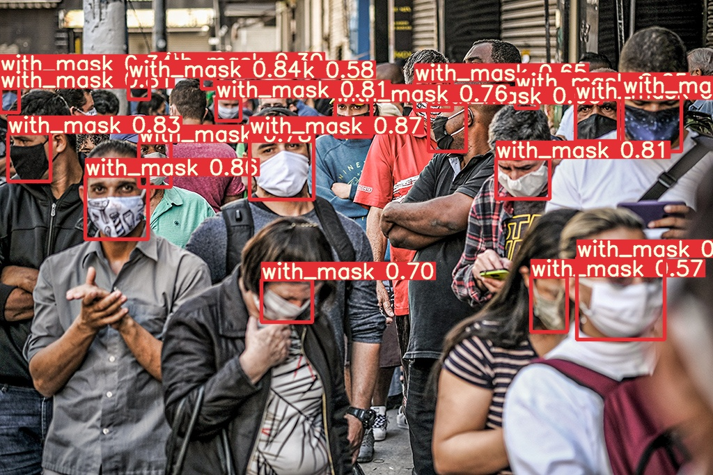
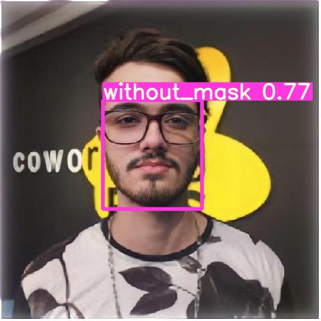

# detectormasks
<h3> Detector de pessoas com e sem mascaras com YoloV5 </h3>

Nesse repositorio você encontra os pesos já treinados para detectar as mascaras wmaskscovid.pt

<h3>Faça o clone do YoloV5.</h3>

<h3>Exemplo de uso para uma imagem: </h3>

 python yolov5/detect.py --source yolov5/data/images/pessoas.jpg --weights wmaskscovid.pt --conf 0.25 

<h3> Você pode também usar a webcam em tempo real: </h3>

python yolov5/detect.py --source 0 --weights wmaskscovid.pt --conf 0.25

<h1 align="center">
    <a href="https://github.com/ultralytics/yolov5">🔗 YoloV5</a>
</h1>

🚀 Veja mais detalhes na documentação oficial do YoloV5

